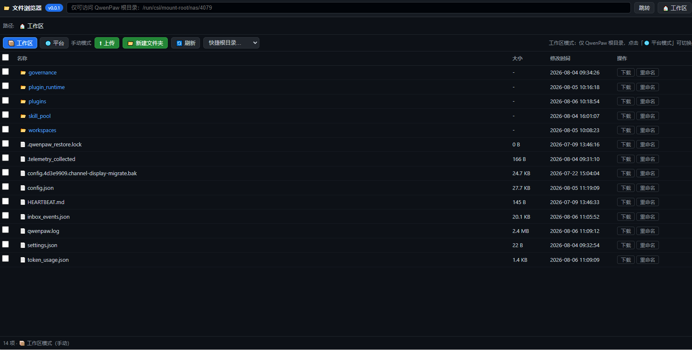

# 📁 文件浏览器 (qwenpaw-file-browser) v0.2.0

QwenPaw 文件浏览器插件：在 QwenPaw 界面里分层级浏览、查看、上传、下载文件与目录，自动识别运行环境（qwenpaw-agentscope-platform 平台 / 本地部署），平台与本地通用。采用 [Apache License 2.0](LICENSE) 许可协议发布。

## 功能（v0.2.0）

- 📂 **分层级浏览目录**：图标 / 名称 / 大小 / 修改时间 / 绝对路径
- 🧭 **刷新保持当前位置**：当前打开的目录记入 localStorage，刷新页面后自动
  恢复到上次打开的位置（保存路径失效时自动清理并回退）
- ⬆️ **上传文件**：多选上传到当前目录，文件名冲突自动重命名为 `name (1).ext`，流式写入
- 📥 **拖拽上传**：把文件/文件夹直接拖入浏览器窗口即可上传到当前目录，悬停显示高亮提示
- 📁 **上传文件夹**：一键选择整个文件夹上传，自动保留目录结构（多层子目录），同名目录自动合并、文件冲突自动重命名
- 🌐 **访问范围自动适配**：
  - qwenpaw-agentscope-platform 平台（WORKING_DIR 位于 `/run/csi/mount-root/nas` 之下）
    默认「平台模式」：可访问所有支持访问的路径（NAS 持久层 / 容器本地盘 `/tmp` `/home`
    `/root` `/workspace` / 系统盘 `/app` 等只读区域），遵循操作系统权限
  - 本地部署默认「工作区模式」：仅访问 QwenPaw 根目录（越界返回 400）
  - 界面提供「🌐 平台模式 / 📦 工作区模式」手动切换
- 🤖 **快捷目录含各智能体工作区**：工作区模式下自动扫描 WORKING_DIR 下的
  `workspaces/` 目录，将每个智能体的工作区以「🤖 <agent_id>（工作区）」加入
  快捷根目录下拉，一键直达任意智能体的工作区（平台模式下同样列出）
- 📁 **文件夹操作**：新建文件夹、重命名（文件/文件夹）、删除（目录递归删除带二次确认）
- 📋 **复制路径**：每个文件/文件夹操作区提供「复制路径」按钮（复制绝对路径到
  剪贴板，干净无附加文字）；点击文件/文件夹的路径行同样可复制，并显示复制成功提示
- ✅ **批量操作**：多选（勾选/全选）→ 批量打包下载（zip，目录递归收集）或批量删除；
  多选模式下自动隐藏上传类按钮（避免误操作）
- 📄 **预览渲染（不限大小）**：全量读取，无 256KB 截断 / 10MB 硬限制
  - **Markdown**（`.md` / `.markdown`）渲染：标题 / 列表 / 任务列表 / 表格 / 引用 /
    代码块（带语法高亮）/ 链接 / 图片等，GitHub Dark 风格
  - **JSON / JSONC**：自动格式化（缩进 2 空格）+ 语法高亮
  - **场景/配置文件**（`.yaml` / `.yml` / `.toml` / `.ini` / `.conf` / `.cfg` /
    `.env` / `.properties` / `.xml`）：语法高亮渲染
  - **常见代码文件**（`.py` / `.js` / `.ts` / `.sh` / `.go` / `.rs` / `.c` / `.cpp` 等）：语法高亮
  - 渲染策略：运行时优先复用宿主全局的 `marked` / `hljs` / `Prism`（若存在），
    否则内置轻量渲染器（零外部依赖、离线可用），外部库输出经 HTML 清洗
  - 二进制文件提示下载
- ⬇️ **下载**：任意文件（二进制安全，附件方式）
- 🔄 **一键刷新**当前目录
- 🎨 **视觉一致**：滚动条样式与 QwenPaw 控制台暗色主题对齐
- 🤖 **AI 助手**：工具栏「🤖 AI 助手」展开可折叠对话面板
  - 发送消息自动附带**当前目录**与**选中文件/文件夹**作为上下文（可看到面板提示）
  - 复用 QwenPaw agent 管线（工具调用/记忆/技能与主聊天一致），SSE 流式渲染，
    支持「⏹ 停止」中断；会话 ID 持久化，刷新后继续同一对话
- 🛡️ **安全**：工作区模式越界拦截；删除保护（禁止删除 `/`、主目录、QwenPaw 数据根目录）；
  写操作遵循系统权限，权限不足返回明确错误



## 接口

挂载于 `/api/qwenpaw-file-browser/`。`path` 支持**绝对路径**或**相对路径**
（相对 WORKING_DIR；空 = WORKING_DIR）。工作区模式下越界路径返回 400：

| 方法 | 路径 | 说明 |
|---|---|---|
| GET  | `/api/qwenpaw-file-browser/status` | 插件状态、版本、WORKING_DIR、当前模式（`mode`/`mode_source`/`platform_detected`）、快捷根目录列表 |
| GET  | `/api/qwenpaw-file-browser/ls?path=<dir>` | 列出目录（返回 `path`/`parent`/`entries`：name/type/size/size_h/mtime/path） |
| GET  | `/api/qwenpaw-file-browser/read?path=<file>&max_bytes=<n>` | 预览文本文件（默认不限大小 `max_bytes=-1`；显式传 `max_bytes` 可截断；二进制返回 415） |
| GET  | `/api/qwenpaw-file-browser/download?path=<file>` | 下载单个文件（附件） |
| POST | `/api/qwenpaw-file-browser/upload?path=<dir>` | 上传文件，multipart 多文件（`files` 字段）；filename 可带相对路径（如 `folder/sub/a.txt`）自动创建父目录保留目录结构，冲突自动重命名，防路径穿越；返回 `saved`/`dirs` |
| POST | `/api/qwenpaw-file-browser/mkdir` | 新建文件夹 `{"path": "...", "parents": false}` |
| POST | `/api/qwenpaw-file-browser/rename` | 重命名 `{"path": "...", "new_name": "..."}`（同目录内） |
| POST | `/api/qwenpaw-file-browser/delete` | 删除 `{"path": "...", "recursive": false}`（目录递归需显式 true） |
| POST | `/api/qwenpaw-file-browser/batch/delete` | 批量删除 `{"paths": ["..."], "recursive": false}`，返回 `deleted`/`failed` |
| GET  | `/api/qwenpaw-file-browser/batch/download?paths=a,b,c` | 批量打包下载 zip（目录递归收集；临时文件响应后自动清理） |
| POST | `/api/qwenpaw-file-browser/ai/chat` | AI 对话（SSE 流式）`{"text", "path", "selected": [], "session_id", "agent_id"}`，复用 QwenPaw agent 管线，自动附带当前目录与选中文件上下文 |
| POST | `/api/qwenpaw-file-browser/mode` | 切换访问模式 `{"mode": "auto"\|"workdir"\|"platform"}`（auto = 自动识别） |

## 安装 / 升级

```bash
# 发布前校验（可选但建议）
qwenpaw plugin validate ./qwenpaw-file-browser
# 安装 / 覆盖更新（QwenPaw 运行中走 API 热装，无需重启）
qwenpaw plugin install ./qwenpaw-file-browser --force
```

> 注意：不要用 `uninstall` + `install` 两步走——`uninstall` 有交互确认
> （`click.confirm`），在脚本 / 非交互环境下会卡住，且旧版未卸载时
> `install` 会因 id 已存在而拒绝。`--force` 一步完成覆盖更新（rmtree
> 旧目录 → 复制新目录），非交互环境不卡。

刷新 QwenPaw 页面，侧边栏/设置菜单出现「📁 文件浏览器」入口，点击进入 `/apps/qwenpaw-file-browser`。
平台（platform.agentscope.io）部署：在插件管理页面上传 zip 即可。

## 目录结构

```
qwenpaw-file-browser/
├── plugin.json   # 清单：type=app, entry backend+frontend, menu, meta.pawapp
├── plugin.py     # 后端：status/ls/read/download/upload/mkdir/rename/delete/batch/mode
├── ui/index.js   # 前端：文件浏览器 GUI（React）
├── CHANGELOG.md  # 变更记录
├── LICENSE       # Apache License 2.0
└── .gitignore
```

## 变更记录

见 [CHANGELOG.md](CHANGELOG.md)。

## 安全警告

- 插件具备**文件系统读写能力**（浏览、上传、新建、重命名、删除），
  以 **QwenPaw 进程身份**访问宿主文件系统，属于高危能力。
- 工作区模式默认仅允许访问 QwenPaw 根目录；平台模式遵循操作系统权限（系统盘只读）。
- 删除操作不可恢复，前端均有二次确认；删除保护禁止删除 `/`、主目录、数据根目录。
- 仅建议在本地 / 可信环境使用；不要部署到不可信公网平台。

## 已知限制

- 预览仅支持 UTF-8 文本；二进制文件请下载查看。不限大小意味着超大文件（数百 MB 以上）
  全量读取会占用较多内存/带宽，渲染可能较慢，属预期行为。
- 内置渲染器支持 GFM 常用语法子集（复杂扩展如 Mermaid 图、脚注等需宿主提供 marked 等全局库时方可渲染）。
- 平台模式下写操作遵循系统权限：系统盘（`/app` 等）只读，写通常会失败并返回明确错误。
- 批量打包下载使用临时 zip 文件，超大目录可能较慢。
